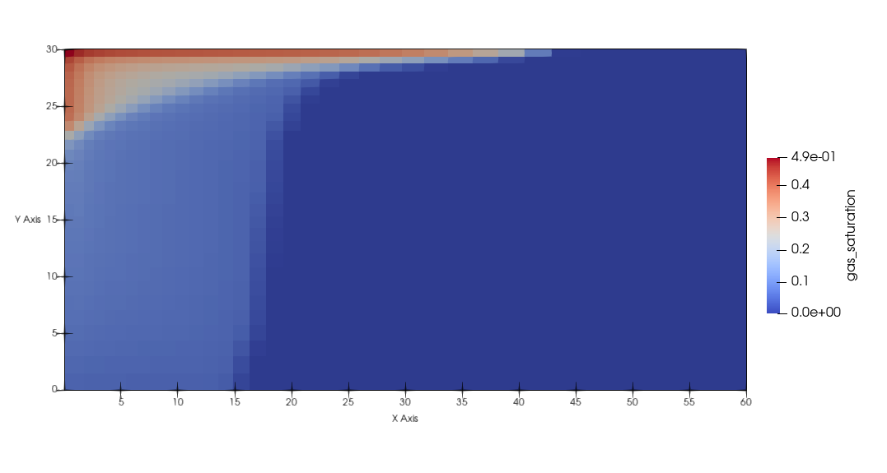

# hystre

## Hydrogen storage in reservoirs

[MOOSE](https://www.mooseframework.com) application for modelling underground storage of hydrogen in saline
aquifers using the [Porous Flow module](https://www.mooseframework.org/modules/porous_flow).

### Getting started

#### Install MOOSE

`hystre` is a [MOOSE](https://www.mooseframework.com) application, so the first step is to download and set up a MOOSE installation. Full instructions are available at the [MOOSE website](https://www.mooseframework.org/getting_started/index.html).

#### Clone hystre

The next step is to clone `hystre` to your machine. In the following, it is assumed that MOOSE is installed in `~/projects` on your machine. If an alternate installation location was used, the following instructions should be modified to use your MOOSE folder path.

To clone `hystre`
```bash
cd ~/projects
git clone https://github.com/cpgr/hystre.git
```

At this stage, your should have a `moose` folder and a `hystre` folder within the same directory.

#### Complie hystre

Next, compile `hystre`
```bash
cd hystre
git checkout master
make -jn
```
where *n* is the number of processing cores on your computer. For example, with an 8 core computer
```bash
make -j8
```
will use all eight cores to compile.

If everything has gone well, `hystre` should compile without error and you should have an executable called `hystre-opt` in the `~/projects/hystre` directory.

#### Test hystre

Within the `hystre` directory, the test suite can be run using
```bash
./run_tests
```
All the tests should pass, and you are now ready to use `hystre` to model H2 injection in saline aquifers.

#### Run hystre

An example 2D radial injection/production problem is provided in `hystre/example/radial`. This can be run using
```bash
cd example/radial
../../hystre-opt -i radial.i
```
using a single core, or in parallel using
```bash
mpirun -n 2 ../../hystre-opt -i radial.i
```

This simulation will take around 30 minutes and produces two outputs: a `.csv` file with the amount of H2 (in kg) in the model at each timestep, and an exodus file (`.e`) that contains all of the variables and auxilliary variables for each timestep. The exodus file can be viewed in many visualisation packages (including the free [paraview](https://www.paraview.org) application used to produce the image below). For example, at the end of the production cycle, the H2 saturation remaining in the reservoir for this example problem looks like



#### Update hystre

Updates to `hystre` can be downloaded using the following from within the `hystre` directory
```bash
git fetch origin
git rebase origin/master
make -jn
./run_tests -jn
```
